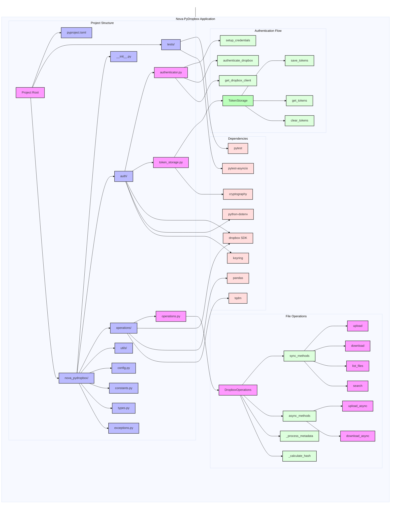

# Nova-PyDropbox

[](https://github.com/liamswan/nova-pydropbox/actions)  
[](https://codecov.io/gh/liamswan/nova-pydrobox))  
[](https://opensource.org/licenses/MIT)  
[](https://github.com/psf/black)

Nova-PyDropbox is an enhanced Python wrapper around the [Dropbox Python SDK](https://github.com/dropbox/dropbox-sdk-python). It provides secure authentication, comprehensive file operations, progress tracking, and seamless integration with popular data science tools.

**Table of Contents**
- [Features](#features)
- [Key Differences from Official SDK](#key-differences-from-official-sdk)
- [Core Dependencies](#core-dependencies)
- [Installation](#installation)
- [Quick Start](#quick-start)
- [Configuration & Environment Setup](#configuration--environment-setup)
- [Architecture](#architecture)
- [Testing, CI/CD & Contributing](#testing-cicd--contributing)
- [Known Limitations & Troubleshooting](#known-limitations--troubleshooting)
- [Roadmap](#roadmap)
- [License](#license)

---

## Features

- **Secure Authentication**
  - OAuth2 implementation using the official Dropbox SDK.
  - System keyring integration with an encrypted fallback mechanism.
  - Automatic token refresh handling.

- **Enhanced File Operations**
  - High-level API built on top of the Dropbox SDK.
  - Intelligent, automatic switching for chunked uploads/downloads based on file size.
  - Automatic retry and robust error management.
  - Visual progress tracking with [tqdm](https://github.com/tqdm/tqdm).

- **Advanced Data Science Integration**
  - Pandas DataFrame responses for effortless data manipulation.
  - Built-in file hash verification to ensure integrity.
  - Recursive directory operations and advanced file filtering.

- **Structured File Management**
  - Typed file operations (e.g., Documents, Images, Videos, Audio).
  - Advanced search with customizable filters.
  - Folder size calculations and detection of empty folders.

---

## Key Differences from Official SDK

Nova-PyDropbox extends the official Dropbox SDK by offering:

1. **Simplified API**
   - High-level operations abstracting common use cases.
   - Automated handling of chunked transfers.
   - Integrated progress bars for extended operations.

2. **Data Science Integration**
   - Direct conversion of responses to Pandas DataFrames.
   - Structured filtering and enhanced metadata tracking.

3. **Enhanced Security**
   - Secure token storage via system keyring with encrypted fallback.
   - Seamless and automated token refresh routines.

---

## Core Dependencies

- **`dropbox`**: Official Dropbox API client.
- **`keyring`**: Secure credential storage.
- **`cryptography`**: Encryption support for fallback token storage.
- **`pandas`**: Data manipulation and analysis.
- **`tqdm`**: Progress visualization.

---

## Installation

Since Nova-PyDropbox is not yet published on PyPI, install it directly from GitHub:

### Using pip

```bash
pip install git+https://github.com/liamswan/nova-pydropbox.git
```

### Using Poetry

```bash
poetry add git+https://github.com/liamswan/nova-pydropbox.git
```

### Development Installation

For development purposes:

```bash
# Clone the repository
git clone https://github.com/liamswan/nova-pydropbox.git
cd nova-pydropbox

# Install dependencies using Poetry
poetry install
```

---

## Quick Start

Here’s a minimal example to get you started:

```python
from nova_pydropbox import Authenticator, FileOperations, FolderOperations

# Perform one-time authentication setup.
auth = Authenticator()
auth.authenticate_dropbox()

# Initialize file and folder operations.
files = FileOperations()
folders = FolderOperations()

# Upload a file with a progress bar.
upload_result = files.upload('local_file.txt', '/remote_file.txt')
print(f"Upload result: {upload_result}")

# Download a file with automatic chunking.
download_result = files.download('/remote_file.txt', 'local_download.txt')

# List files and receive a Pandas DataFrame for further analysis.
df_files = folders.list_files("/my_folder")
print(df_files[['name', 'size', 'modified']])
```

---

## Configuration & Environment Setup

Nova-PyDropbox uses environment variables for authentication. To configure:

1. **Dropbox API Credentials**:  
   Create a `.env` file in your project root with the following content:
   ```dotenv
   DROPBOX_APP_KEY=your_app_key
   DROPBOX_APP_SECRET=your_app_secret
   ```
2. **Additional Configuration**:  
   For further settings (such as encryption configurations), see the [Configuration Documentation](#) (link to your docs).

---

## Architecture

Nova-PyDropbox is organized to ensure modularity and scalability. Here’s an architectural overview:



### Key Architecture Components

1. **Project Structure**
   - Modular design for clear separation of concerns.
   - Centralized configurations, utilities, and type definitions.

2. **Authentication Flow**
   - Secure token management using system keyring with fallback encryption.
   - OAuth2-based authentication seamlessly integrated with the Dropbox client.

3. **File Operations**
   - Efficient file and folder management with automated chunking and progress tracking.
   - Integrity checks using built-in hash verification.

4. **Dependencies**
   - Core integration with Dropbox SDK and secure storage libraries.
   - Enhanced functionality for data manipulation via pandas and user feedback through tqdm.
   - Comprehensive testing supported by pytest and pytest-asyncio.

---

## Testing, CI/CD & Contributing

### CI/CD
- **Multi-platform Testing:** Automated tests run on Ubuntu, Windows, and macOS.
- **Code Coverage:** Tracked via Codecov.
- **Automated Dependency Updates:** Integrated with CI pipelines.

### Running Tests Locally

```bash
pytest
```

### Contributing

Contributions are welcome! Follow these steps to contribute:
1. Fork the repository.
2. Create a feature branch:
   ```bash
   git checkout -b feature/amazing-feature
   ```
3. Commit your changes:
   ```bash
   git commit -m 'Add amazing feature'
   ```
4. Push to your branch:
   ```bash
   git push origin feature/amazing-feature
   ```
5. Open a Pull Request.

For detailed guidelines, please see our [CONTRIBUTING.md](#) (link to your contributing guide).

---

## Known Limitations & Troubleshooting

**Known Limitations:**
- Automatic chunking may need manual tuning for certain edge-case file sizes.
- Progress bar display might differ across terminal environments.
- OAuth token refresh can encounter issues if the underlying keyring service is not available.

**Troubleshooting Tips:**
- Verify that your environment variables are correctly set.
- Check logs for detailed error information.
- For persistent issues, please open an issue on GitHub.

## License

Distributed under the MIT License. See [LICENSE](LICENSE) for more information.
