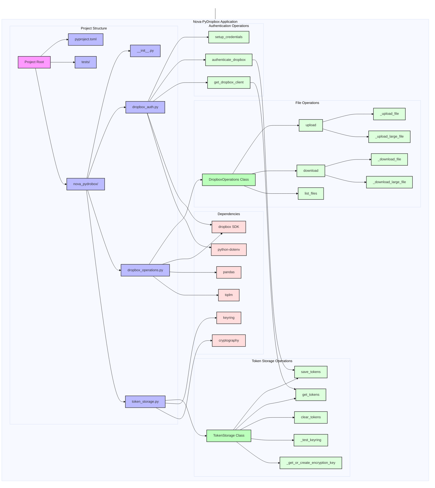

# Nova-PyDropbox

A Python CLI tool for interacting with Dropbox, featuring secure credential management and extensive file operations support.

## Features

- 🔐 Secure credential storage using system keyring or encrypted file fallback
- 🔄 OAuth2 authentication flow with automatic token refresh
- 📁 Comprehensive file operations:
  - File/folder upload with chunked transfer
  - File/folder download with progress tracking
  - List files with filtering options
  - Advanced file operations (move, copy, delete)
- 📊 DataFrame-based file listing results
- 🎯 Hash verification for file integrity
- 📈 Progress tracking for large operations
- 💪 Strong typing and error handling
- 🛡️ Secure token management

## Installation

```bash
# Clone the repository
git clone https://github.com/yourusername/nova-pydrobox.git
cd nova-pydrobox

# Install using Poetry (recommended)
poetry install

# Or using pip
pip install .
```

## Quick Start

1. First, set up authentication:
```bash
python dropbox_auth.py
```
This will:
- Open the Dropbox App Console in your browser
- Guide you through creating a Dropbox app
- Help you authenticate with your Dropbox account

2. List your files:
```bash
python list_files.py
```

## File Operations

The package provides comprehensive file operations through the `DropboxOperations` class:

- Upload files/folders with progress tracking
- Download files/folders with chunked transfer
- List files with filtering by type and size
- Hash verification for file integrity
- DataFrame-based results for easy analysis

Example filter usage:
```python
filter_criteria = FileFilter(
    file_type=FileType.DOCUMENT,
    min_size=1024,  # 1KB
    max_size=1024*1024,  # 1MB
    recursive=True
)
```

## Security

- Credentials are stored securely using the system keyring when available
- Fallback to encrypted file storage when keyring is not available
- OAuth2 flow with PKCE for enhanced security
- Automatic token refresh handling
- File integrity verification through hashing

## Dependencies

Core:
- dropbox: Dropbox API client
- python-dotenv: Environment variable management
- keyring: Secure credential storage
- cryptography: Encryption for fallback storage
- pandas: Data manipulation and analysis
- tqdm: Progress bar functionality

Optional:
- secretstorage: Linux keyring support
- keyrings-alt: Alternative keyring backends

## Architecture



This updated documentation better reflects the current state of the project, including the comprehensive file operations capabilities, enhanced security features, and the addition of progress tracking and data handling features. The architecture diagram now shows the detailed structure of the DropboxOperations class and its relationships with other components.
