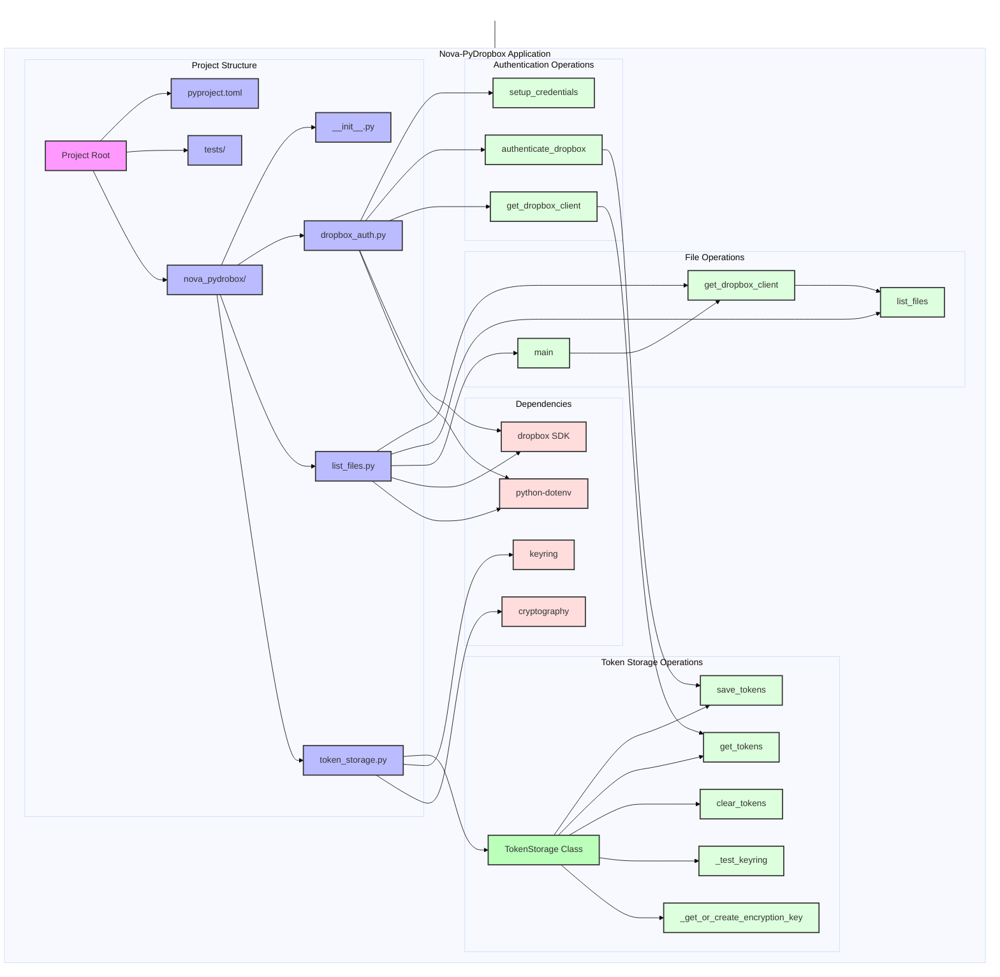

The diagram shows:
1. Accurate project structure with all modules in nova_pydrobox package
2. Complete TokenStorage class structure and methods
3. Authentication flow with TokenStorage integration
4. File operations with Dropbox client usage
5. All external dependencies

Key components:
- token_storage.py provides secure credential management with keyring/file fallback
- dropbox_auth.py handles OAuth2 flow and client initialization
- list_files.py implements file listing functionality
- Dependencies reflect actual usage in pyproject.toml